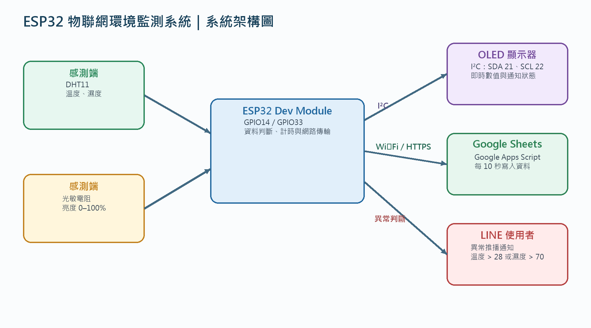
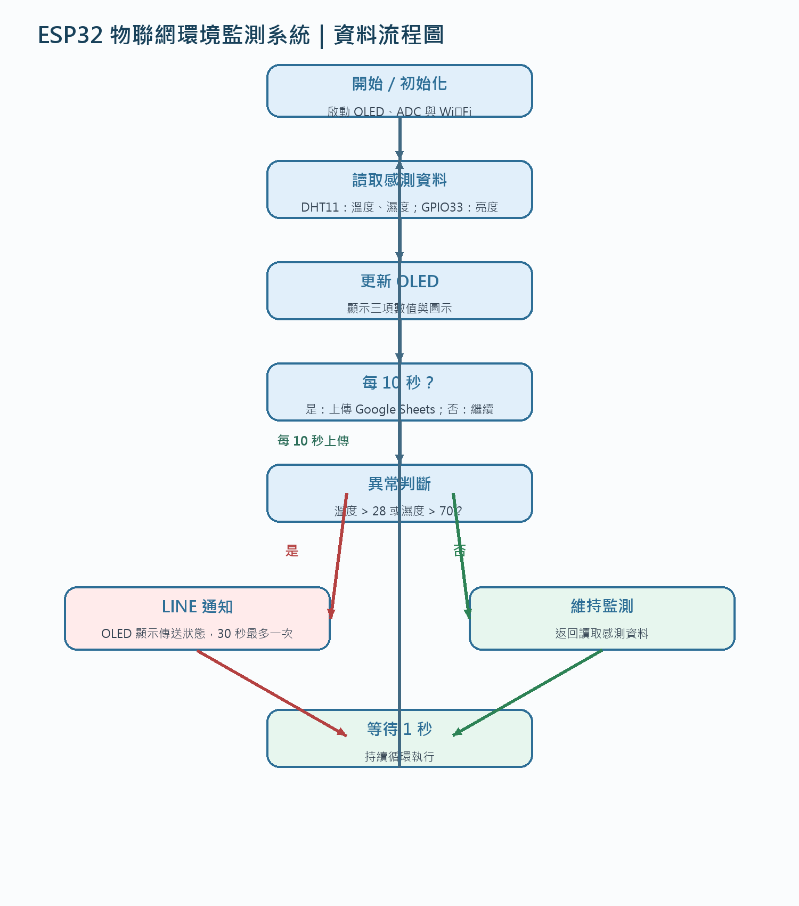
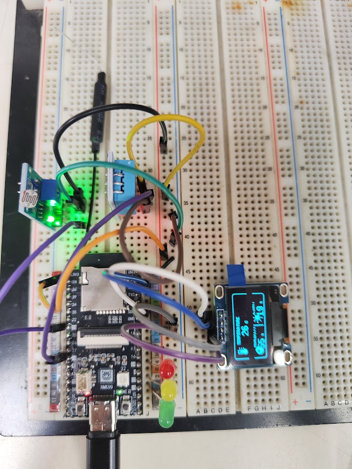
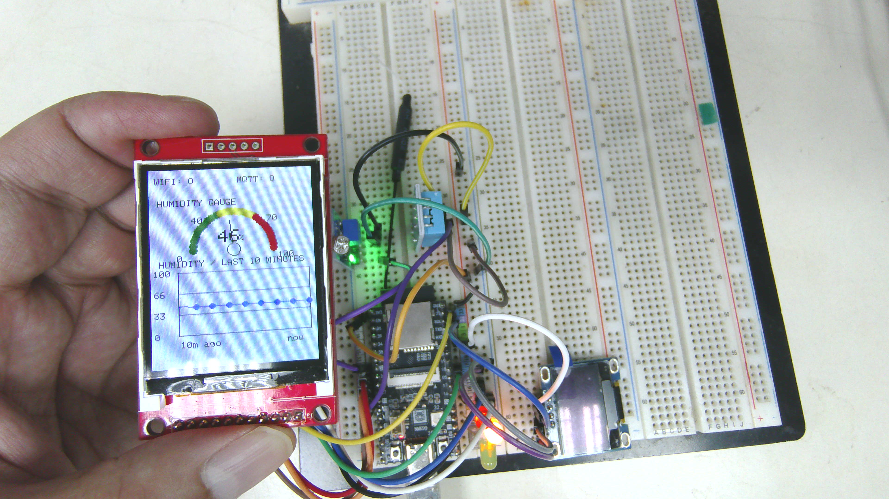
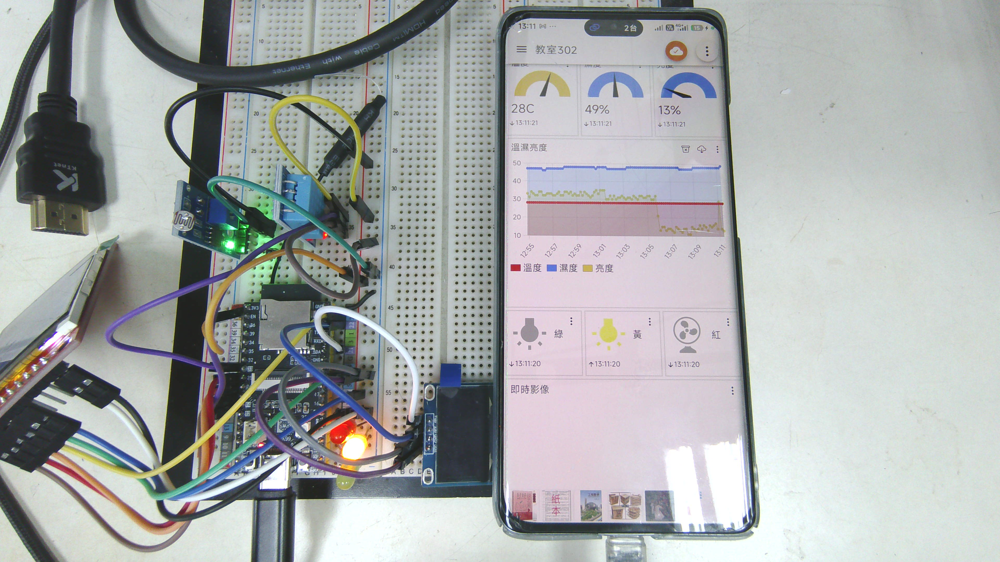

# ESP32 Sensors, MQTT, TFT & E-Paper

這是 ESP32 感測器與顯示器實習專案，從 GPIO、LED、按鍵與類比輸入開始，逐步延伸到 DHT 溫濕度、光線感測、Wi‑Fi、HTTP API、雲端服務、MQTT、ILI9225 TFT 與 2.9 吋三色電子紙。

## 展示網站

本專案提供一個以 GitHub Pages 發布的展示網站，集中呈現系統概念、硬體成果照片、電子紙畫面與範例分類：**[開啟展示網站](https://youjunjer.github.io/esp32-sensors-mqtt-tft-epaper-eric/)**。

## 專案成果與範例照片

系統架構與資料流程：

電子紙畫面範例：

實作成果照片：

更多照片、流程圖、架構圖與模擬畫面請參考 [`成果照片`](成果照片)、`架構圖_0914_imagegen.png`、`流程圖_0914_imagegen.png` 與 `webcam_epaper.png`。

## 範例程式說明

### 基礎 GPIO、LED 與感測器

| 程式 | 功能說明 |
|---|---|
| [`01_hello/01_hello.ino`](01_hello/01_hello.ino) | 最基本的 ESP32 程式。啟動序列埠後，每秒輸出一次測試文字，示範 `setup()`、`loop()` 與 Serial Monitor。 |
| [`02_LED/02_LED.ino`](02_LED/02_LED.ino) | 使用 GPIO15 控制單顆 LED，以快速 HIGH/LOW 切換示範數位輸出。 |
| [`03_RGYLED/03_RGYLED.ino`](03_RGYLED/03_RGYLED.ino) | 使用 GPIO15、GPIO2、GPIO4 依序控制紅、黃、綠 LED，示範交通號誌式時序。 |
| [`04_button/04_button.ino`](04_button/04_button.ino) | 讀取 GPIO16 按鍵狀態，按下或觸發時控制 GPIO15 LED，並將輸入值輸出到序列埠。 |
| [`05_nightLight/05_nightLight.ino`](05_nightLight/05_nightLight.ino) | 讀取 GPIO36 光敏元件的類比值，依環境亮度分級控制 RGB LED，實作夜燈效果。 |
| [`06_analogWrite/06_analogWrite.ino`](06_analogWrite/06_analogWrite.ino) | 以不同 PWM duty cycle 驅動 GPIO15，示範亮度/等效電壓的變化與 `map()` 換算。 |
| [`07_RGB_analog/07_RGB_analog.ino`](07_RGB_analog/07_RGB_analog.ino) | 以類比 PWM 控制 RGB LED，示範紅、綠及混色（例如淡紫色）的亮度組合。 |
| [`07_RGB_digital/07_RGB_digital.ino`](07_RGB_digital/07_RGB_digital.ino) | 以數位 HIGH/LOW 控制 RGB LED，示範紅綠相加形成黃色等基本混色。 |
| [`08_RGBCycle/08_RGBCycle.ino`](08_RGBCycle/08_RGBCycle.ino) | 以 PWM 漸變方式在 RGB 顏色之間平滑轉換，示範 LED 淡入淡出動畫。 |

### Wi‑Fi、OLED 與雲端服務

| 程式 | 功能說明 |
|---|---|
| [`21_wifi_pm25_json_OLED_DHT/21_wifi_pm25_json_OLED_DHT.ino`](21_wifi_pm25_json_OLED_DHT/21_wifi_pm25_json_OLED_DHT.ino) | 整合 DHT11、環境部 PM2.5 API 與 128×64 OLED；每 30 秒取得 PM2.5、溫度與濕度並顯示。相關功能拆在同資料夾的 `02_DHT.ino`、`3_WIFI.ino` 與 `4_OLED.ino`。 |
| [`22_dht_light_oled/22_dht_light_oled.ino`](22_dht_light_oled/22_dht_light_oled.ino) | 讀取 DHT11 與光敏電阻，將溫度、濕度、光線與狀態以圖示化介面呈現在 OLED。 |
| [`23_dht_light_oled_thingspeak/23_dht_light_oled_thingspeak.ino`](23_dht_light_oled_thingspeak/23_dht_light_oled_thingspeak.ino) | 在 `22` 的感測與 OLED 顯示上加入 Wi‑Fi 與 ThingSpeak HTTP 上傳，每 15 秒送出資料。 |
| [`24_google_dht_light_oled/24_google_dht_light_oled.ino`](24_google_dht_light_oled/24_google_dht_light_oled.ino) | 將 DHT11/光線資料顯示於 OLED，並透過 HTTPS 與 Google Apps Script 寫入 Google Sheet。 |
| [`25_dht_line/25_dht_line.ino`](25_dht_line/25_dht_line.ino) | 結合 DHT11、光線、OLED、Google Sheet 與 LINE Messaging API，將感測資料上傳並推播通知。 |

### MQTT 與遠端控制

| 程式 | 功能說明 |
|---|---|
| [`26_mqtt/26_mqtt.ino`](26_mqtt/26_mqtt.ino) | 讀取 DHT11 與光線感測器，在 OLED 顯示狀態，並透過 MQTT 發布感測資料。三色 LED 可作為本地狀態指示。 |
| [`27_mqtt_ctrl/27_mqtt_ctrl.ino`](27_mqtt_ctrl/27_mqtt_ctrl.ino) | 在 MQTT 感測資料發布之外，訂閱三個控制 topic，遠端控制綠、黃、紅 LED，模擬電燈、風扇與除濕機。 |

### ILI9225 TFT 顯示器

| 程式 | 功能說明 |
|---|---|
| [`29_ili_color/29_ili_color.ino`](29_ili_color/29_ili_color.ino) | 直接以 SPI 驅動 176×220 ILI9225，輪播純色畫面，驗證 TFT 初始化、色彩與座標寫入。 |
| [`31_ili9225_dht/31_ili9225_dht.ino`](31_ili9225_dht/31_ili9225_dht.ino) | 在 ILI9225 顯示器上繪製儀表板，週期性顯示 DHT11 溫度與濕度。 |
| [`32_ili9225_gfx_dht/32_ili9225_gfx_dht.ino`](32_ili9225_gfx_dht/32_ili9225_gfx_dht.ino) | 將 ILI9225 封裝成 `Adafruit_GFX` 相容介面，加入 DHT11 與光線資料及圖形化面板。 |
| [`33_ili_mqtt/33_ili_mqtt.ino`](33_ili_mqtt/33_ili_mqtt.ino) | 將 ILI9225 儀表板、DHT11/光線感測、Wi‑Fi 與 MQTT 整合，顯示連線及發布狀態。 |
| [`34_ili_mqtt_ctrl/34_ili_mqtt_ctrl.ino`](34_ili_mqtt_ctrl/34_ili_mqtt_ctrl.ino) | 在 TFT 儀表板上加入 MQTT 控制功能、ArduinoJson 訊息解析、三色 LED 控制與台灣時區時間。 |
| [`35_ili_mqtt_ctrl_page/35_ili_mqtt_ctrl_page.ino`](35_ili_mqtt_ctrl_page/35_ili_mqtt_ctrl_page.ino) | 延伸 `34` 的遠端控制功能，以按鍵切換 TFT 頁面，顯示感測資料、MQTT 控制與系統狀態。 |

### 三色電子紙

| 程式 | 功能說明 |
|---|---|
| [`36_epaper/36_epaper.ino`](36_epaper/36_epaper.ino) | 驗證 2.9 吋 V4 三色電子紙驅動，使用黑/紅雙 buffer 以橫向畫布顯示基本 Hello World 圖樣。 |
| [`37_epaper_tag/37_epaper_tag.ino`](37_epaper_tag/37_epaper_tag.ino) | 將電子紙做成價格標籤/資訊卡版面，結合黑紅文字、圖示與中秋 bitmap 素材。 |
| [`38_epaper_moon/38_epaper_moon.ino`](38_epaper_moon/38_epaper_moon.ino) | 以電子紙繪製中秋月亮主題畫面，示範 bitmap、文字與雙色版面配置。 |
| [`39_epaper_dht/39_epaper_dht.ino`](39_epaper_dht/39_epaper_dht.ino) | 讀取 DHT11 與光線感測器，每 60 秒更新電子紙上的環境資訊，降低不必要的刷新。 |
| [`40_epaper_mqtt/40_epaper_mqtt.ino`](40_epaper_mqtt/40_epaper_mqtt.ino) | 完整整合電子紙、DHT11、光線、Wi‑Fi、MQTT 與三色 LED；顯示感測資料並接受 MQTT 遠端控制。 |

## 硬體與函式庫

- ESP32 Dev Module
- DHT11、光敏電阻、RGB/三色 LED、按鍵
- SSD1306 128×64 OLED、ILI9225 176×220 TFT、2.9 吋 V4 三色電子紙
- 常用函式庫：`SimpleDHT`、`U8g2`、`Adafruit GFX`、`PubSubClient`、`ArduinoJson`
- 電子紙驅動與共用原始碼位於各電子紙範例資料夾及 [`電子紙_模組`](電子紙_模組)

## 使用方式

1. 安裝 Arduino IDE 或 Arduino CLI，選擇相容的 ESP32 board package。
2. 依範例資料夾名稱開啟對應的 `.ino` 檔案；同一資料夾內的 `.ino` 分檔會由 Arduino 一起編譯。
3. 安裝該範例需要的函式庫，並依程式內的 GPIO 設定完成接線。
4. 上傳前，將 Wi‑Fi、MQTT、ThingSpeak、LINE、Google Apps Script 或政府資料 API placeholder 改成自己的設定。
5. 電子紙與 TFT 的 SPI 腳位及方向可能因模組不同而異，請依實際硬體調整。

## 公開 repository 的安全提醒

本 repository 刻意不包含實際的 Wi‑Fi 密碼、服務 token 或 API key。範例中的敏感設定已替換為 placeholder；請勿將真實憑證提交到 GitHub。若任何憑證曾經被公開，請立即到對應服務撤銷並重新產生。

## 其他文件

- `0810物聯網成果報告.docx`、`0914物聯網成果報告.docx`：專案報告
- `build_report.py`、`build_report_0914.py`：報告產生工具
- `handoff.md`：開發交接與目前進度紀錄

## 授權

目前未指定額外開源授權；如需允許他人重用程式碼，建議另行加入適合的 LICENSE。
